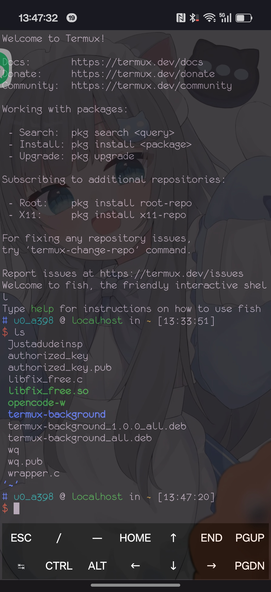
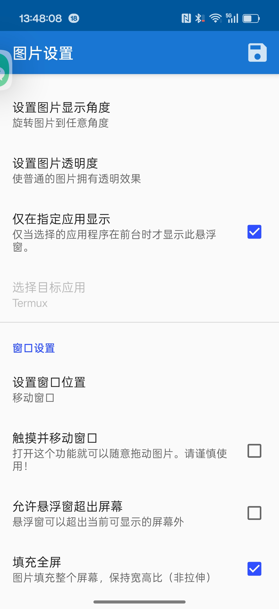

# FloatPicture 悬浮图片

[](https://codebeat.co/projects/github-com-xfy9326-floatpicture-master)

[English](README.md)

---

FloatPicture 是一款 Android 悬浮窗应用，可以在手机屏幕上显示任意自定义图片（不支持 GIF 动画）。

**注：[原仓库](https://github.com/XFY9326/FloatPicture) 目前不再维护。**

*本应用基于 GNU GPL 3.0 协议开源*

---

**一些问题**

它将覆盖输入发法的屏幕部分。
但它仍然很适合不需要屏幕输入的应用程序,
如 bilibili 或Termux(使用蓝牙键盘)

<p align="center">
  
  
</p>

## 功能

### 单张图片设置

每张图片拥有独立设置项，通过图片列表中的 **选项 → 编辑** 进入：

- **图片名称** — 自定义名称便于区分
- **调整大小** — 按比例缩放窗口与图片
- **旋转角度** — 旋转图片到任意角度（0–360°）
- **透明度** — 调整透明度 0–100%
- **窗口位置** — 手动设置 X/Y 坐标或拖动定位
- **触摸移动** — 开启后可用手指拖动图片
- **允许超出屏幕** — 悬浮窗可超出屏幕边界

### 填充全屏

开启后悬浮窗填满整个屏幕，图片保持宽高比覆盖全屏（类似 `CENTER_CROP`），不会拉伸变形。

**实现原理：**
- `FloatImageView` 的 `ScaleType` 从 `MATRIX` 切换为 `CENTER_CROP`
- 窗口布局参数从 `WRAP_CONTENT` 变为 `MATCH_PARENT`，位置设为 `(0, 0)`
- 使用原始未缩放的 Bitmap，由系统 Center Crop 自动处理显示

### 仅在指定应用显示

限制悬浮窗只在选定应用的前台时显示。适合将参考图片固定显示在特定应用上方。

**使用方法：**
1. 在**图片控制设置**中开启开关
2. 点击**选择目标应用** — 弹出已安装应用列表（含 RadioButton 选择）
3. 首次使用需授予**使用情况访问权限**
4. 从列表中选择目标应用，点确认生效

切换到目标应用时悬浮窗自动显示，离开时自动隐藏。

---

## 前台应用检测

使用 `UsageStatsManager.queryEvents()` 检测当前前台应用：

```java
UsageEvents events = usm.queryEvents(beginTime, endTime);
// 遍历事件，找到最近的 MOVE_TO_FOREGROUND 事件
```

**所需权限：** `PACKAGE_USAGE_STATS` — 用户在 设置 → 使用情况访问权限 中授予。

---

## 权限说明

| 权限                                                 | 用途              |
|----------------------------------------------------|-----------------|
| `SYSTEM_ALERT_WINDOW` / `TYPE_APPLICATION_OVERLAY` | 显示悬浮窗           |
| `READ_EXTERNAL_STORAGE` / `WRITE_EXTERNAL_STORAGE` | 读取和缓存图片         |
| `RECEIVE_BOOT_COMPLETED`                           | 开机自启动           |
| `FOREGROUND_SERVICE`                               | 保持通知栏服务运行       |
| `PACKAGE_USAGE_STATS`                              | 检测前台应用（应用过滤器功能） |

`<queries>` 清单元素用于查询可启动的应用列表，供应用选择器使用。

---

## 架构说明

### 窗口管理

所有悬浮窗操作通过 `WindowsMethods` 统一管理：
- `createWindow()` — 将 view 添加到 `WindowManager`（已 attached 时自动 fallback 到 `updateViewLayout`）
- `updateWindow()` — 更新布局参数或重新添加（已 detached 时自动 `addView`）
- `safeRemoveView()` — 仅在 view 已 attached 时才执行 remove，避免崩溃

这些安全检查确保前台监控异步添加/移除窗口时不会崩溃。

### 数据存储

每张图片的设置以 JSON 文件存储在 `FloatPicture/Data/` 目录下：
- `PictureList.list` — 图片 ID 到显示名称的映射
- `PictureData.list` — 图片 ID 到设置 JSON 对象的映射

主要数据字段：
| 字段 | 类型 | 说明 |
|---|---|---|
| `SHOW_ENABLED` | boolean | 总显示开关 |
| `POSITION_X/Y` | int | 窗口坐标 |
| `ZOOM` | float | 缩放倍数 |
| `DEFAULT_ZOOM` | float | 计算的默认缩放 |
| `ALPHA` | float | 透明度 |
| `DEGREE` | float | 旋转角度 |
| `TOUCH_AND_MOVE` | boolean | 拖动移动 |
| `ALLOW_PICTURE_OVER_LAYOUT` | boolean | 超出屏幕 |
| `FILL_SCREEN` | boolean | 填充全屏 |
| `FILTER_APP_ENABLED` | boolean | 应用过滤器开关 |
| `FILTER_APP_PACKAGE` | string | 目标应用包名 |
| `FILTER_APP_NAME` | string | 目标应用显示名 |

### 图片渲染

默认使用 `ScaleType.MATRIX` + Bitmap 级缩放（`ImageMethods.resizeBitmap()`）。Matrix 变换处理缩放和旋转。填充全屏模式下切换为 `ScaleType.CENTER_CROP`。
